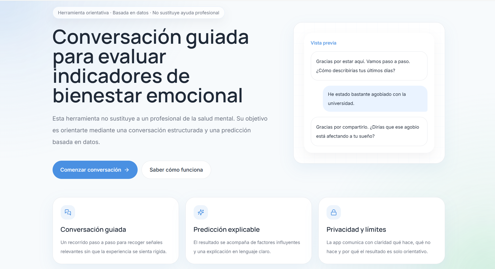
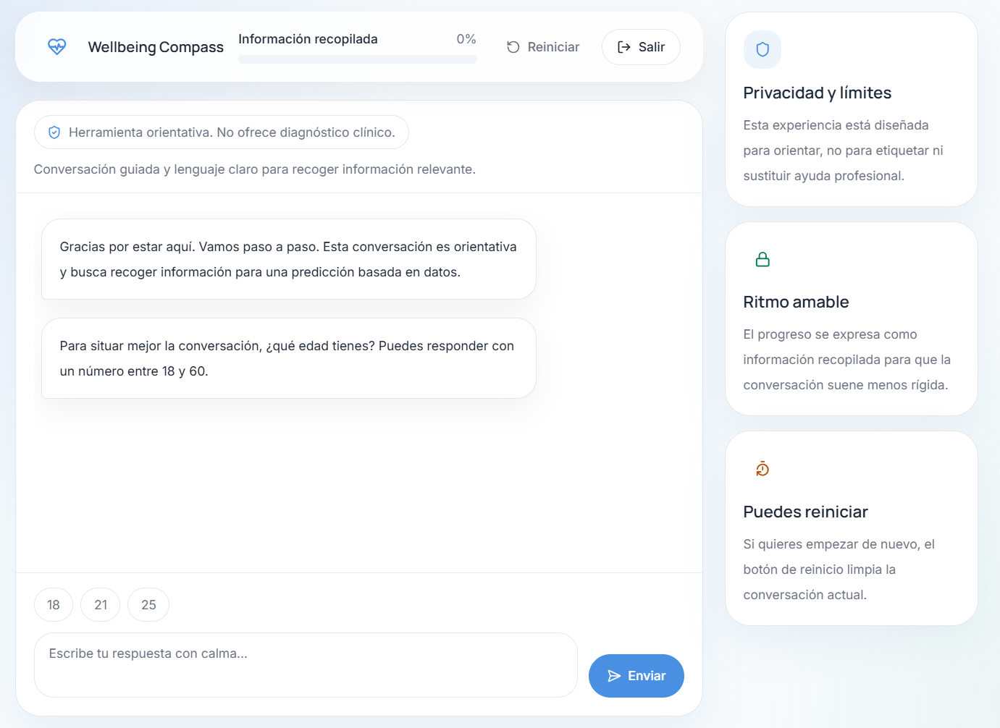

# Student Depression Risk Assessment

End-to-end ML product that predicts depression risk from student lifestyle and academic signals, exposed through a production web app for guided self-assessment.

[](https://student-depresion-production-5f0c.up.railway.app/)


Production app: https://student-depresion-production-5f0c.up.railway.app/

<p align="center">
  
  
</p>

## What this project proves

- Production-oriented ML system, not just a notebook: ETL, training, model selection, API, frontend, Docker, and deployment.
- Model choice is driven by product risk, with recall prioritized to reduce missed high-risk cases.
- Clear deployment discipline through a quality gate before a model is considered release-ready.
- Full-stack ownership: backend inference service, user-facing React experience, and prediction logging for monitoring.
- Strong technical communication: metrics, architecture, tradeoffs, and limitations are explicit.

## Live Demo

**Try it here:** https://student-depresion-production-5f0c.up.railway.app/

What you can do:

- Complete a guided mental-health risk assessment through a conversational UI.
- Submit the 14 real model features used by the backend.
- Receive a prediction, confidence score, risk framing, and user-friendly follow-up guidance.

What you will see:

- Landing page with product framing and safety messaging.
- Multi-step assessment flow.
- Results page with prediction output and explanation-oriented recommendations.

## Tech Stack

### ML / Data

- Python 3.11
- pandas
- scikit-learn
- XGBoost
- pyarrow

### Backend

- FastAPI
- Pydantic
- joblib
- JSON Lines prediction logging

### Frontend

- React 19
- Vite
- Tailwind CSS
- Framer Motion
- React Router

### Infra / DevOps

- Docker
- Docker Compose
- Railway deployment
- Makefile-based local workflows
- pytest test suite

## System Architecture

```text
Student input
  -> React assessment flow
  -> FastAPI /predict endpoint
  -> preprocessing pipeline
  -> trained classification model
  -> prediction + probability
  -> results UI + prediction log storage
```

Core flow:

- Raw Kaggle dataset is cleaned, normalized, and split into train / validation / production sets.
- Training compares multiple candidate models on the same feature space.
- The winning artifact is serialized with its preprocessor and deployment metadata.
- FastAPI loads that artifact at startup and serves inference endpoints.
- The frontend calls the API and turns structured predictions into a user-facing product experience.

Recommended diagram for the repo header:

- `Dataset -> ETL -> Model Comparison -> Quality Gate -> Model Registry -> FastAPI -> React UI -> Prediction Logs`

## ML Approach

Models compared:

- Logistic Regression
- Random Forest
- XGBoost

Selection policy:

- Deployment-ready models first
- Then ranked by `recall -> f1_score -> roc_auc -> precision -> accuracy`

Why this matters:

- In this product, a false negative is more expensive than a false positive.
- Missing a high-risk student is a worse product failure than triggering an unnecessary follow-up.
- The training process therefore optimizes for business and safety impact, not leaderboard vanity.

Preprocessing choices:

- Numeric features are scaled for Logistic Regression and passed through for tree-based models.
- Categorical features are encoded with `OrdinalEncoder(handle_unknown="use_encoded_value", unknown_value=-1)`.
- Invalid `Financial Stress` values are coerced and removed during ETL.

## Results & Metrics

Latest deployed-ready model: **Logistic Regression**

Validation metrics:

- Accuracy: **85.5%**
- Precision: **86.5%**
- Recall: **89.2%**
- F1 Score: **87.8%**
- ROC-AUC: **92.5%**

Confusion matrix:

- True Positives: `2915`
- True Negatives: `1857`
- False Positives: `456`
- False Negatives: `352`

Interpretation:

- The model catches most positive-risk cases, which is the primary design goal.
- Precision remains high enough to keep false alarms operationally reasonable.
- ROC-AUC above `0.92` indicates strong class separation, not just threshold luck.
- The model passes an explicit deployment gate:
  - `precision >= 0.75`
  - `recall >= 0.70`
  - `f1_score >= 0.72`
  - `roc_auc >= 0.80`

## Features

User-facing:

- Guided conversational assessment instead of a raw form.
- Risk prediction with probability score.
- Result screen with supportive recommendations and safety framing.
- Production web app accessible from a public URL.

Technical:

- ETL pipeline with stratified `60/20/20` splits.
- Multi-model training and ranking.
- Versioned model artifacts and metadata.
- Backend health check and prediction history endpoints.
- Persistent prediction logging in `JSONL`.
- Dockerized backend with deploy validation hooks.

## Project Structure

```text
app/
  api.py           # FastAPI app and inference endpoints
  pipeline.py      # ETL, normalization, and dataset splits
  train.py         # model comparison, evaluation, and artifact generation
  schemas.py       # request/response contracts
  pred_store.py    # prediction persistence

frontend/
  src/pages/       # product screens
  src/components/  # chat, results, and UI components
  src/services/    # API integration

config/
  deployment_criteria.yaml

models/
  model_v*.pkl
  metadata_v*.json

tests/
  test_pipeline.py
  test_train.py
  test_model.py
  test_api.py
```

## Run Locally

### Backend

```bash
pip install -r requirements.txt
python -m app.pipeline
python -m app.train
```

Create `.env` with:

```env
MODEL_PATH=models/model_v3.pkl
METADATA_PATH=models/metadata_v3.json
```

Start the API:

```bash
uvicorn app.api:app --reload --port 8083
```

### Frontend

```bash
cd frontend
npm install
npm run dev
```

Default local URLs:

- Frontend: `http://localhost:5173`
- API: `http://localhost:8083`

### Docker

```bash
docker compose build
docker compose up
```

## Future Improvements

- Add per-prediction explainability with SHAP instead of only global importance.
- Add threshold tuning and calibration analysis for safer operating points.
- Extend CI/CD to cover the frontend and end-to-end smoke tests.
- Add model monitoring dashboards for drift, prediction volume, and error trends.
- Version datasets and experiments more formally with a lightweight registry layer.

## Notes

- This product is built as a technical portfolio project with production-minded engineering choices.
- It is not a clinical diagnostic tool and should not replace professional mental-health evaluation.

## Suggested README Enhancements

- Place a short GIF directly under the hero section showing: landing -> assessment -> prediction result.
- Keep the current badges above the fold; add CI and deploy badges once those endpoints are public.
- If you record a demo, use a 20-30 second clip focused on user flow, not code.
